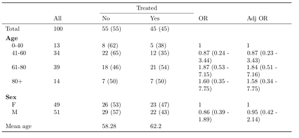
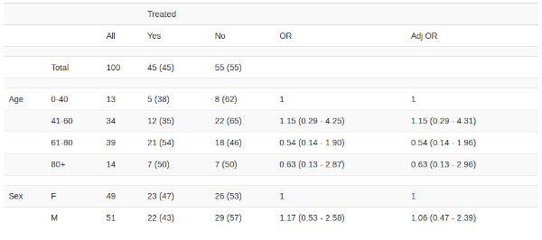

```{r, message=F, warning=F}
library(epitab)
library(dplyr)
```

`epitab` provides functionality for building contingency tables with a variety of additional configurations. It was initially designed for use in epidemiology, as an extension to the `Epi::stat.table` function. However, by identifying core components of a descriptive table, it is flexible enough to be used in a variety of disciplines and situations. This vignette provides an overview of the types of tables that can be built using `epitab`.

## Data

For demonstration purposes, a simulated data set representing an observational study of a disease will be used. This fictitious disease primarily affects elderly people, and not every patient receives first-line treatment. The disease itself comes in two variants: *A* and *B*.

```{r}
set.seed(17)
treat <- data.frame(age=abs(rnorm(100, 60, 20)),
                    sex=factor(sample(c("M", "F"), 100, replace=T)),
                    variant=factor(sample(c("A", "B"), 100, replace=T)),
                    treated=factor(sample(c("Yes", "No"), 100, replace=T), levels=c("Yes", "No")))
treat$agebin <- cut(treat$age, breaks=c(0, 40, 60, 80, 9999),labels=c("0-40", "41-60", "61-80", "80+")) 
```

```{r}
treat %>%
    head() %>%
    knitr::kable()
```

## Contingency tables

Contingency tables are useful tools for exploratory analysis of a data set, and highlight relationships between one or more *independent* variables and (typically one) *outcome* of interest. The example code below shows how to build a basic contingency table to view how treatment varies by age group and sex.

Both the *independent* and *outcome* variables are passed in through lists, where the column names **must** be quoted strings (thereby allowing for these tables to be used in automated scripts). The list entry labels are used to provide the column and row labels. The `crosstab_funcs` argument specifies what summary measures should be calculated for each covariate / outcome combination. The `freq` function calculates the frequency of each of these cells, and (optionally) provides the proportion in parentheses.

```{r}
contingency_table(independents=list("Age"="agebin",
                                    "Sex"="sex"),
                  outcomes=list("Treated"="treated"),
                  crosstab_funcs=list(freq()),
                  data=treat)
```

Using this standard contingency table as a starting point, there are several ways to customise the table. The presence of the overall frequency column is controlled by the `marginal` argument. There are also options to `freq` that specify the formatting of the cross-tabulated frequencies (see `?freq` for more details).

```{r}
contingency_table(independents=list("Age"="agebin",
                                    "Sex"="sex"),
                  outcomes=list("Treated"="treated"),
                  crosstab_funcs=list(freq(proportion = "none")),
                  marginal=FALSE,
                  data=treat)
```

Note that multiple outcomes can be selected, although it still results in a 2-way contingency table between all the covariates and the outcomes independently. It is not currently possible to produce a 3-way contingency table.

```{r}
contingency_table(independents=list("Age"="agebin",
                                    "Sex"="sex"),
                  outcomes=list("Treated"="treated", "Variant"="variant"),
                  crosstab_funcs=list(freq()),
                  data=treat)
```

## Adding supplementary information

Additional statistics can be added to these contingency tables in two ways. *Column-wise measures* act on each outcome in turn without regard to the covariates, while *row-wise measures* are those that are calculated for every level of each independent variable.

### Column-wise measures

It is often the case that in addition to the categorical variables included in the contingency table, there are continuous attributes that we are interested in. The `col_funcs` argument to `contingency_table` calculates summary measures for each outcome and can be used for this purpose.

The example below shows how to calculate mean age across treatment types, using the provided function `summary_mean`, to which the name of the continuous variable of interest is passed as a string.

```{r}
contingency_table(independents=list("Age"="agebin",
                                    "Sex"="sex"),
                  outcomes=list("Treated"="treated"),
                  crosstab_funcs=list(freq()),
                  col_funcs=list("Mean age"=summary_mean("age")),
                  data=treat)
```

As with `crosstab_funcs`, multiple summary values can be passed to `col_funcs`. The example below shows the use of the other column-wise function provided with `epitab`: `summary_median`.

```{r}
contingency_table(independents=list("Age"="agebin",
                                    "Sex"="sex"),
                  outcomes=list("Treated"="treated"),
                  crosstab_funcs=list(freq()),
                  col_funcs=list("Mean age"=summary_mean("age"),
                                 "Median age"=summary_median("age")),
                  data=treat)
```

### Row-wise measures

Another common addition is to display the coefficients of a regression model that relates the independent variables with an outcome (although not necessarily the same outcome displayed in the contingency table). For example, we may be interested to see how treatment varies by age group by looking at the odds ratios (ORs) of a univariate logistic regression. This functionality is provided by the `row_funcs` argument to `contingency_table`, which accepts a named list of functions that meet the correct requirements. The two functions provided with this package are `odds_ratio` and `hazard_ratio`, used to display coefficients resulting from logistic regression and Cox regression respectively. 

The example below shows how to specify that the odds ratios should be calculated in addition to the cross-tabulated frequencies. The only required argument to `odds_ratio` is the name of the outcome variable. 

```{r}
contingency_table(list("Age"="agebin",
                       "Sex"="sex"),
                  outcomes=list("Treated"='treated'),
                  data=treat, 
                  crosstab_funcs=list(freq()),
                  row_funcs=list("OR"=odds_ratio('treated'))
                 )
```

Additional arguments to `odds_ratio` allow the model to adjust for every other covariate included in `independents`, specify the largest group as the baseline, and select whether to include confidence intervals. Note that multiple functions can be provided to `row_funcs`. While the table below may not fit on the page of this document, it fits neatly within the standard R terminal output. Strategies for neatly displaying tables are discussed later on.

```{r}
contingency_table(list("Age"="agebin",
                       "Sex"="sex"),
                  outcomes=list("Treated"='treated'),
                  data=treat, 
                  crosstab_funcs=list(freq()),
                  row_funcs=list("OR"=odds_ratio('treated', relevel_baseline=TRUE),
                                 "Adj OR"=odds_ratio('treated', adjusted=TRUE, 
                                                     relevel_baseline=TRUE))
                 )
```

Another use case in epidemiology is when survival is the outcome of interest. Such data is more appropriately modelled using Cox regression, which can be specified with the `hazard_ratio` function. This requires the outcome to be specified as a string detailing a `Surv` object, for example `hazard_ratio("Surv(time, status)")`. See the help page `?hazard_ratio` for further details.

### Tips

There is no limit to the number of column-wise and row-wise functions that can be supplied, although too many can hinder readability and detract from the purpose of the table.

```{r}
contingency_table(independents=list("Age"="agebin",
                                    "Sex"="sex"),
                  outcomes=list("Treated"="treated"),
                  crosstab_funcs=list(freq()),
                  col_funcs=list("Mean age"=summary_mean("age"),
                                 "Median age"=summary_median("age")),
                  row_funcs=list("OR"=odds_ratio('treated', relevel_baseline=TRUE),
                                 "Adj OR"=odds_ratio('treated', adjusted=TRUE, 
                                                     relevel_baseline=TRUE)),
                  data=treat)
```

This flexibility of `epitab` allows for either simple summary tables that are used to highlight a trend within the data, or more complex reference tables that hold a large amount of summary statistics.

```{r}
contingency_table(independents=list("Age"="agebin",
                                    "Sex"="sex"),
                  outcomes=list("Treated"="treated", "Disease variant"="variant"),
                  crosstab_funcs=list(freq()),
                  col_funcs=list("Mean age"=summary_mean("age"),
                                 "Median age"=summary_median("age")),
                  row_funcs=list("Treatment OR"=odds_ratio('treated', relevel_baseline=TRUE),
                                 "Disease variant OR"=odds_ratio('variant', 
                                                                 relevel_baseline=TRUE)),
                  data=treat)
```

`contingency_table` can even be used when there is no cross-tabulation, for example as a means of displaying regression coefficients.

```{r}
contingency_table(independents=list("Age"="agebin",
                                    "Sex"="sex"),
                  row_funcs=list("OR"=odds_ratio('treated', relevel_baseline=TRUE),
                                 "Adj OR"=odds_ratio('treated', adjusted=TRUE, 
                                                     relevel_baseline=TRUE)),
                  data=treat)
```

## Publication quality tables

The default `print` method of these contingency tables is designed for a standard wide R console, where the entire table fits width-wise. However, for situations where a table is being produced for distribution or publication of any type, greater attention to detail and appearance is required. `epitab` provides several options for exporting clean-looking tables.

### `neat_table` to HTML and PDF

The `neat_table` function provided in `epitab` builds a cleanly formatted table for output to HMTL or LaTeX, using `knitr::kable` and the `kableExtra` package. The output of `neat_table` is a `kable` object and so can be passed to `kableExtra::kable_styling()`, allowing for the specification of various cosmetic settings. See the help files for both `neat_table` and `kableExtra::kable_styling` for further details.

```{r}
contingency_table(independents=list("Age"="agebin",
                                    "Sex"="sex"),
                  outcomes=list("Treated"='treated'),
                  crosstab_funcs=list(freq()),
                  row_funcs=list("OR"=odds_ratio('treated'),
                                 "Adj OR"=odds_ratio('treated', adjusted=TRUE)),
                  col_funcs=list("Mean age"=summary_mean("age")),
                  data=treat) %>%
              neat_table() %>%
              kableExtra::kable_styling(bootstrap_options=c("striped", "hover"), 
                                        full_width=FALSE)
```

Due to the vignette markdown theme, these styling changes won't appear in this HTML. The screenshot below shows how the table appears when using the above code in the default Rmarkdown template.


For outputting to PDF documents using LaTeX, the same `neat_table` function can be used, but now the `latex` output format must be specified. Also it is **highly** recommended to use the `booktabs` argument to produce far cleaner looking tables.

```{r, eval=F}
contingency_table(independents=list("Age"="agebin",
                                    "Sex"="sex"),
                  outcomes=list("Treated"='treated'),
                  crosstab_funcs=list(freq()),
                  row_funcs=list("OR"=odds_ratio('treated'),
                                 "Adj OR"=odds_ratio('treated', adjusted=TRUE)),
                  col_funcs=list("Mean age"=summary_mean("age")),
                  data=treat) %>%
              neat_table('latex', booktabs=TRUE) %>%
              kableExtra::kable_styling(font_size=8)
```

The above call will display the table below using the default Rmarkdown template.



### `kable`

If full control of the table appearance is required, then the raw character matrix is provided as the `mat` attribute of the output of `contingency_table`. It can be used in conjunction with `knitr::kable` and `kableExtra`. NB: The default value for `format` in `kable` is *pandoc*, which does not work well with `epitab`, try *html* or *markdown* instead.

```{r}
contingency_table(list("Age"="agebin",
                                    "Sex"="sex"),
                               outcomes=list("Treated"='treated'),
                               crosstab_funcs=list(freq()),
                               row_funcs=list("OR"=odds_ratio('treated'),
                                              "Adj OR"=odds_ratio('treated', adjusted=TRUE)),
                               data=treat)$mat %>% 
        knitr::kable("html") %>%
        kableExtra::kable_styling(bootstrap_options="striped")
```

Again note that the stylistic changes made above will not display in the vignette you are currently reading due to the vignette template, but they will appear in your Rmarkdown output as shown below.



### Word

Since Word is a proprietary format, it is challenging to directly embed tables into documents. The most convenient method to export a contingency table into Word involves the following steps:

  1. Save the raw table as a CSV (see code snippet below)
  2. Open the CSV in Excel and copy the table
  3. Right click in a Word document and select *Paste Options -> Use Destination Styles*
  4. Adjust table appearance using standard *Table Tools | Design* options
  
```{r, eval=F}
tab <- contingency_table(independents=list("Age"="agebin",
                                           "Sex"="sex"),
                         outcomes=list("Treated"="treated"),
                         crosstab_funcs=list(freq()),
                         col_funcs=list("Mean age"=summary_mean("age"),
                                        "Median age"=summary_median("age")),
                         row_funcs=list("OR"=odds_ratio('treated', relevel_baseline=TRUE),
                                        "Adj OR"=odds_ratio('treated', adjusted=TRUE, 
                                                            relevel_baseline=TRUE)),
                         data=treat)
write.table(tab$mat, "mytable.csv", row.names=FALSE, col.names=FALSE, sep=',')
```

## Custom summary functions

In the above examples, the summary functions used to build up the table in `crosstab_funcs`, `row_funcs`, and `col_funcs` have been provided by `epitab`. However, for greater flexibility, any correctly parametrised function can be supplied instead. This section details the appropriate form for each of these 3 arguments.

### Cross-tabulated

The functions passed in to `crosstab_functions` are run for each combination of outcome and independent variable level.

Arguments:

  - `data`: A subset of the full data, the strata of individuals with the current independent variable level.
  - `outcome_level`: A string providing the current outcome level. 
  - `outcome_name`: A string providing the current outcome variable. 
  - `independent_level`: A string providing the current independent level.
  - `independent_name`: A string providing the current independent variable. 
  
The function must return a vector of length one, representing the statistic for this covariate-level / outcome-level pair.

The example function below calculates the proportion of each treatment type per covariate level (rather than also displaying the counts as `freq` does).

```{r}
proportion <- function(data, outcome_level=NULL, outcome_name=NULL, independent_level=NULL, independent_name=NULL) {
    if (!is.null(outcome_level) && !is.null(outcome_name))
        data <- data[data[[outcome_name]] == outcome_level, ]
    
    count <- if (!is.null(independent_level) && !is.null(independent_name)) {
        sum(data[[independent_name]] == independent_level)
    } else {
        nrow(data)
    }
    
    proportion <- count / nrow(data)
    sprintf("%0.1f%%", proportion*100)
}
```

```{r}
contingency_table(independents=list("Age"="agebin",
                                    "Sex"="sex"),
                  outcomes=list("Treated"="treated"),
                  crosstab_funcs=list(proportion),
                  data=treat)
```

### Column-wise 

The column-wise functions provided with `epitab` are `summary_mean` and `summary_median`, and are used to investigate relationships between the outcome variables that aren't necessarily associated with the categorical covariates.

Args:

  - `data`: The full data set that was passed to `contingency_table`.
  - `outcome_level`: The current level of the outcome, as a string.
  - `outcome_name`: The current outcome, as a string.

Returns:

The function must return a single value, representing the statistic for this outcome level.

The example function below extends `summary_mean` by adding the standard deviation in parentheses. It is hard-coded to work for the continuous variable `age` in the dummy data set.

```{r}
meanage_sd <- function(data, outcome_level=NULL, outcome_name=NULL) {
    if (!is.null(outcome_level) && !is.null(outcome_name)) 
        data <- data[data[[outcome_name]] == outcome_level, ]
    mean <- round(mean(data[['age']]), 2)
    sd <- round(sd(data[['age']]), 2)
    paste0(mean, " (", sd, ")")
}
```

```{r}
contingency_table(independents=list("Age"="agebin",
                                    "Sex"="sex"),
                  outcomes=list("Treated"="treated"),
                  crosstab_funcs=list(freq()),
                  col_funcs=list("Mean age"=summary_mean("age"),
                                 "Mean age (sd)"=meanage_sd),
                  data=treat)
```

### Row-wise

Row-wise functions are used to estimate summary measures for the independent variables outside of the contingency table. This can be useful for providing a summary statistic that is not necessarily related to the outcome variables. This example will describe the case where we wish to run a linear regression on a continuous outcome, in particular, this example will regress on continuous age. This is not a particularly helpful analysis, since one of the covariates is age group, but it will serve as an example. These functions are run for each independent variable and must be parametrised as follows:

Args:

  - `data`: The data set originally passed into `contingency_table`.
  - `var`: The current independent variable, as a string.
  - `all_vars`: All independent variables as passed into `independents`. This is provided to allow regression models to adjust for other covariates.

The function must return a vector with length equal to the number of levels of `var`.

```{r}
lr <- function(data, var=NULL, all_vars=NULL) {
    if (is.null(var) || is.null(all_vars)) {
        return("")
    }
    levs <- levels(data[[var]])
    form <- as.formula(paste('age ~', var))
    mod <- lm(form, data)
    coefs <- c(coef(mod), 1)  # Add baseline as 1
    # coefficients are named with <variable><level>
    labels <- paste0(var, levs)
    # set baseline name in coefficients vector
    names(coefs)[length(coefs)] <- labels[1]
    round(coefs[labels], 3)
}
```

```{r}
contingency_table(list("Age"="agebin",
                       "Sex"="sex"),
                  outcomes=list("Treated"='treated'),
                  data=treat, 
                  crosstab_funcs=list(freq()),
                  row_funcs=list("Regression on age"=lr)
                 )
```
